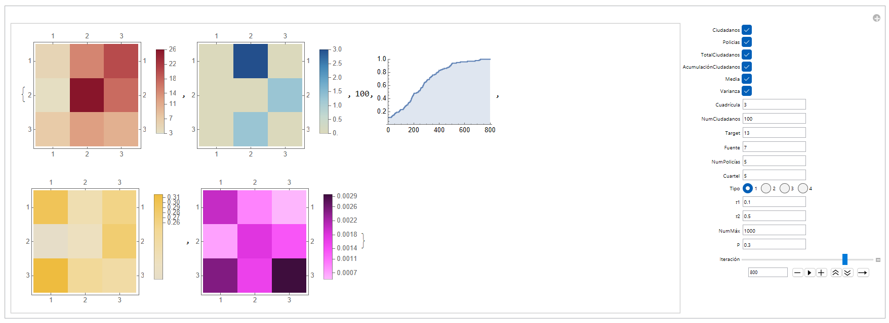

# Civil Unrest Modeling Platform
Modeling Revolt Dynamics: Understanding Citizen and Police Agent Behavior.

Welcome to the Civil Unrest Modeling Platform! This platform has been developed in Mathematica to simulate and analyze dynamics of revolts in urban environments. 

We introduce an interface of an advanced agent-based model that delves into the intricate dynamics between citizens and police agents amidst a city-wide revolt, using a grid-based representation. Our research showcases an enhanced interface derived from A. España et al.' 2021 agent-based model, enabling a comprehensive analysis of citizens' decision-making processes regarding participation in or withdrawal from the revolt, alongside their movement patterns as the revolt progressively spreads.

Our interface serves as a valuable tool for studying the complex interplay between citizens and law enforcement during civil unrest. By simulating various scenarios within the city grid, we gain insights into the factors that influence individuals to either join the revolt or distance themselves from it. Furthermore, our model captures the evolving patterns of citizen movement as the revolt engulfs different areas of the city.

The interface we present facilitates the analysis of critical decision-making processes and movement dynamics, contributing to a more comprehensive exploration of the complexities inherent in civil unrest scenarios.

## Files

1. **Initial_condition.nb**: This file contains the code necessary to construct the initial condition executed in the model. Here, you can set the initial parameters and configurations of the city represented in a grid format.

2. **AB-model.nb**: In this file, you will find the main code of the revolt model implemented in the Mathematica environment. This code defines the interactions between citizen agents and police agents, as well as the rules and dynamics governing behavior during the revolt.

3. **model-interface.nb**: The "model-interface" file contains the code necessary to execute the Mathematica Manipulate, which provides an interactive interface to explore and visualize the results of the revolt model. This interface allows you to analyze citizens' decision-making processes and movement patterns as the revolt spreads.

## Usage

1. Make sure you have Mathematica installed on your system.
2. Open the **model-interface.nb** file in Mathematica.
3. Execute the code within the **model-interface.nb** file.
4. Use the interactive controls in the interface to adjust the parameters and observe how the revolt evolves in the city.
5. Explore the results and analyze movement patterns, citizen participation, and other relevant dynamics in the context of civil unrest.

Enjoy the modeling experience, and feel free to reach out to us if you have any questions or suggestions!

## References

A. España, E. Ugalde and A. Aguilera (2021). An agent-based model for social uprising, in Computational Sociology: discussion and research, El Colegio de San Luis. Pp. 274-299. E-ISBN: 978-607-8794-38-6.

